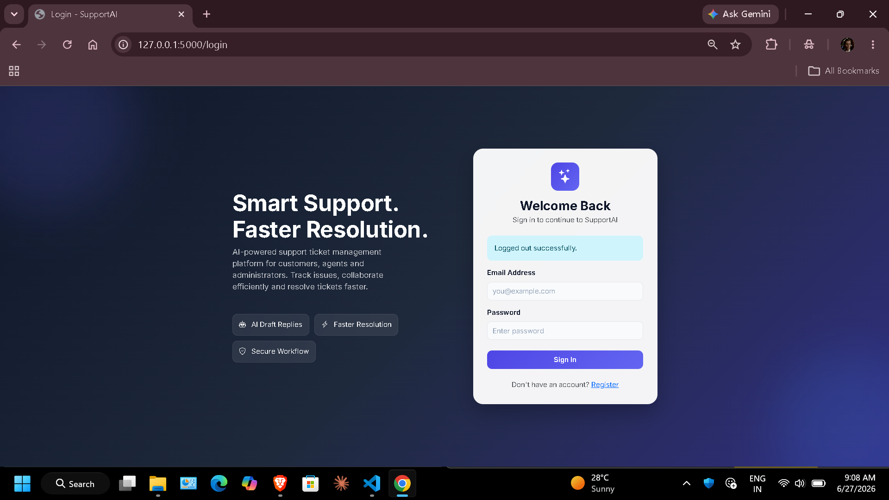
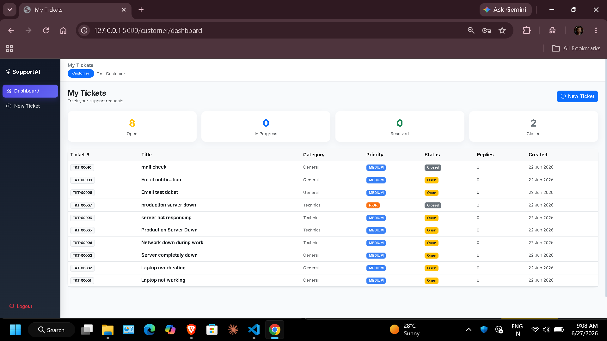
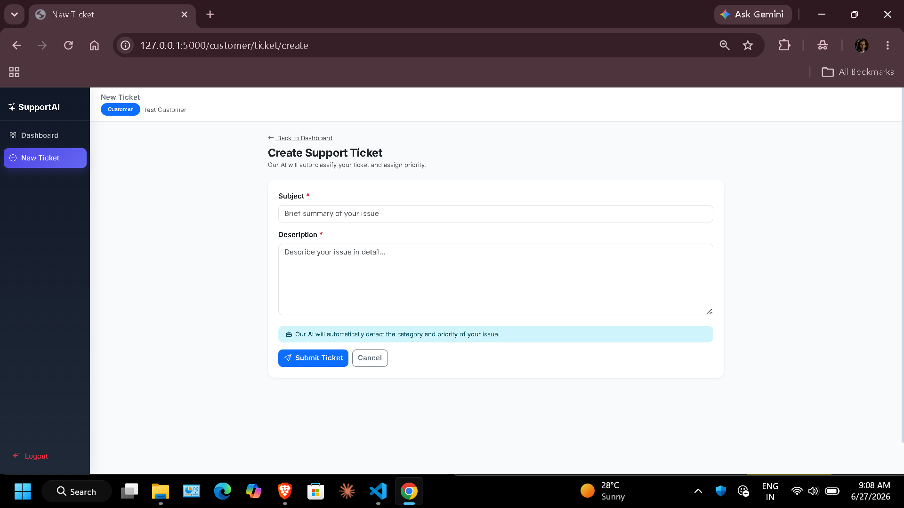
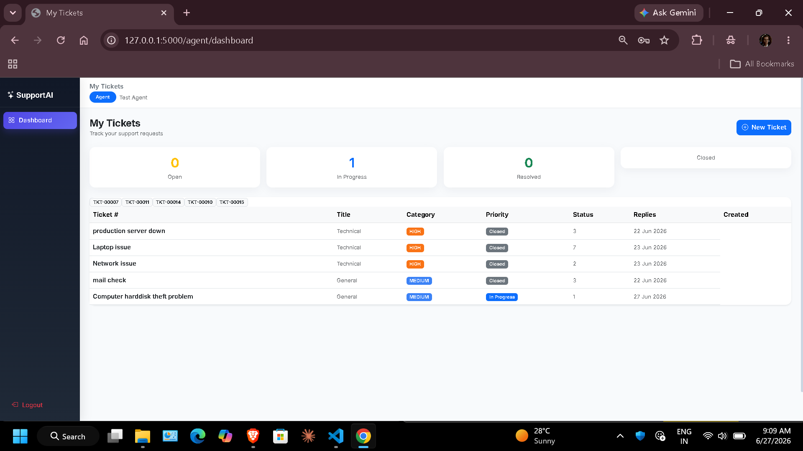
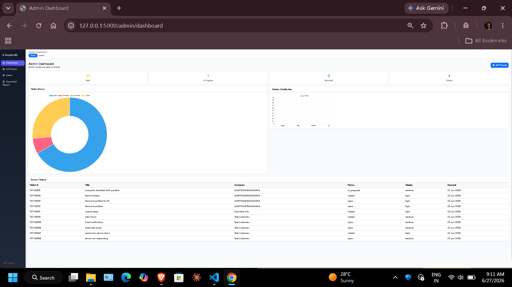
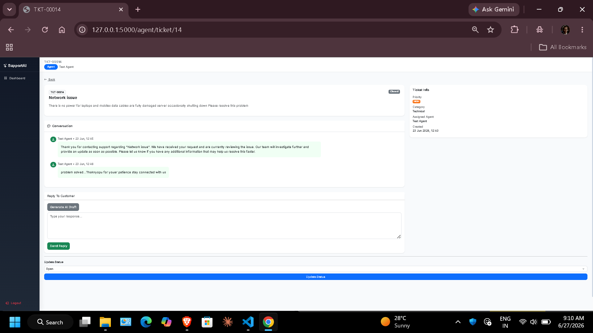
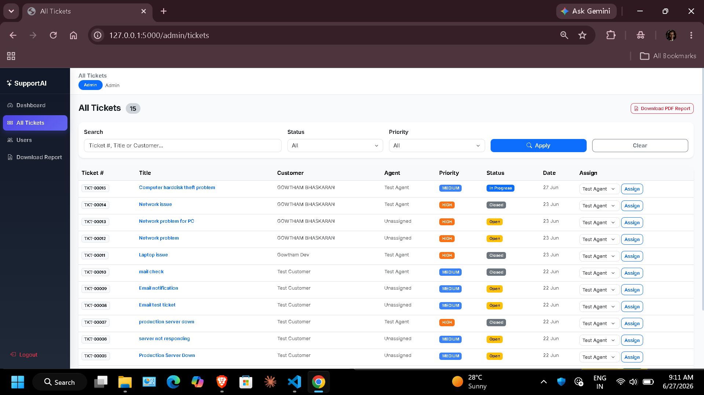
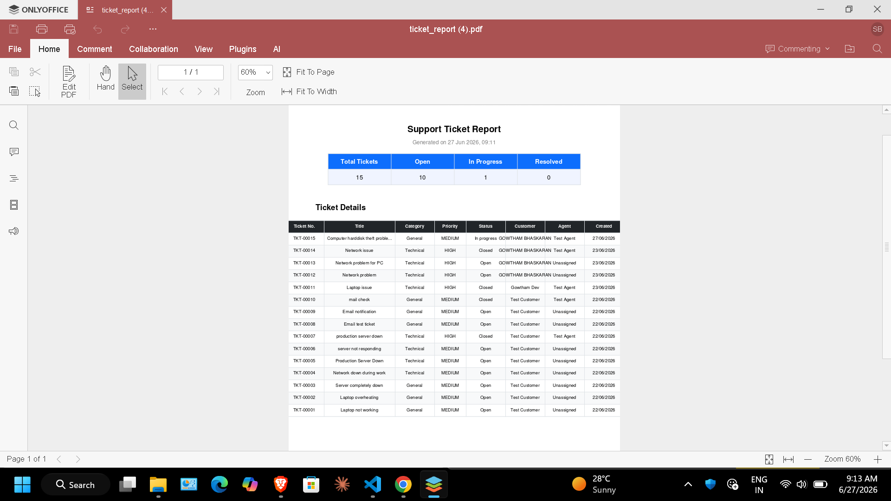

# 🎫 SupportAI - AI Powered Ticket Management System

SupportAI is a full-stack customer support ticket management system built using Flask and MySQL. It provides separate dashboards for Customers, Support Agents, and Administrators while integrating AI to automate ticket classification and response drafting.

---

## Features

### Customer

- Register and Login
- Create Support Tickets
- AI-powered Ticket Classification
- View Ticket Status
- Reply to Tickets
- Ticket Timeline

### Agent

- View Assigned Tickets
- Assign Tickets to Self
- AI-generated Draft Replies
- Internal Notes
- Update Ticket Status
- Reply to Customers

### Admin

- Dashboard Analytics
- User Management
- Assign Tickets
- Ticket Monitoring
- Download PDF Reports

---

## AI Features

- Automatic Ticket Category Detection
- Automatic Priority Prediction
- AI Draft Reply Generation

---

## Email Notifications

- Ticket Created
- Agent Reply
- Ticket Resolved

---

## Tech Stack

Frontend

- HTML
- CSS
- Bootstrap 5
- JavaScript

Backend

- Python
- Flask

Database

- MySQL

AI

- OpenAI API

Others

- Flask-MySQLdb
- bcrypt
- ReportLab

---

## Screenshots

### Login



### Customer Dashboard



### Create Ticket



### Agent Dashboard



### Admin Dashboard



### Ticket Detail



### Admin Ticket Detail



### PDF Report



---

## Installation

```bash
git clone https://github.com/Gowtham-vg/ai-support-ticket-system.git

cd SupportAI

pip install -r requirements.txt
```

Create a `.env` file and add your configuration.

Run:

```bash
python app.py
```

---

## Future Improvements

- File Attachments
- JWT Authentication
- Real-time Notifications
- Agent Performance Dashboard
- Dark Mode

---

## Author

**Gowtham Bhaskaran**
